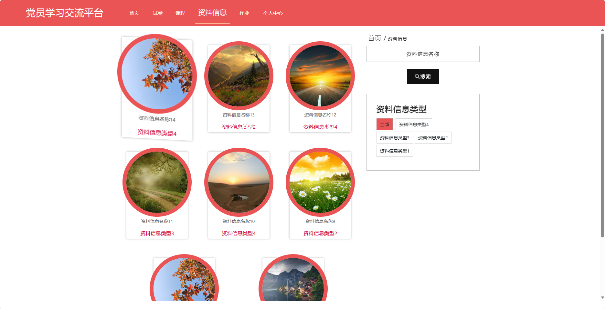

基于SpringBoot的党员学习交流平台（程序+论文）
=
- 完整代码获取地址：从戎源码网 ([https://armycodes.com/](https://armycodes.com/))
- 作者微信：19941326836  QQ：952045282 
- 承接计算机毕业设计、Java毕业设计、Python毕业设计、深度学习、机器学习
- 选题+开题报告+任务书+程序定制+安装调试+论文+答辩ppt 一条龙服务
- 所有选题地址https://github.com/nature924/allProject

一、项目介绍
---
基于Spring Boot框架实现的党员学习交流平台，系统包含两种角色：管理员、用户,系统分为前台和后台两大模块，主要功能如下。

### 前台功能：
- 首页：展示平台的概况、最新资讯等内容。
- 试卷：提供在线考试的试卷和答题功能。
- 课程：提供在线学习的课程和视频资料。
- 资料信息：展示各类学习资料和文献资源。
- 作业：发布和提交学习作业，并提供批改和评分功能。
- 个人中心：用户可以管理个人信息。

### 后台功能：
### 管理员：
- 个人中心：管理个人信息和账户。
- 管理员管理：管理系统管理员账号，包括新增、编辑、删除管理员账号。
- 老师管理：管理教师账号，包括新增、编辑、删除教师账号。
- 用户管理：管理用户账号，包括查看用户列表、禁用用户账号等操作。
- 试卷管理：管理试卷的信息，包括新增、编辑、删除试卷以及设置试卷属性。
- 试题管理：管理试题的信息，包括新增、编辑、删除试题以及试题分类。
- 考试管理：管理考试的信息，包括发布考试、查看考试成绩等操作。
- 作业管理：管理作业的信息，包括新增、编辑、删除作业以及设置截止日期。
- 作业提交管理：查看学生的作业提交情况，包括批改作业、评分等操作。
- 课程管理：管理课程的信息，包括新增、编辑、删除课程以及发布课程资料。
- 签到管理：管理学员的签到情况，包括查看签到记录和统计签到率等操作。
- 资料信息管理：管理学习资料和文献资源的信息，包括新增、编辑、删除资料信息。
- 基础数据管理：管理系统的基础数据，例如试卷分类、课程分类等信息。
- 轮播图信息：管理首页轮播图的展示，包括新增、编辑、删除轮播图信息。

### 老师：
- 个人中心：管理个人信息和账户。
- 用户管理：查看学员账号列表和信息。
- 试卷管理：管理试卷的信息，包括新增、编辑、删除试卷以及设置试卷属性。
- 试题管理：管理试题的信息，包括新增、编辑、删除试题以及试题分类。
- 考试管理：管理考试的信息，包括发布考试、查看考试成绩等操作。
- 作业管理：管理作业的信息，包括新增、编辑、删除作业以及设置截止日期。
- 作业提交管理：查看学生的作业提交情况，包括批改作业、评分等操作。
- 课程管理：管理课程的信息，包括新增、编辑、删除课程以及发布课程资料。
- 签到管理：管理学员的签到情况，包括查看签到记录和统计签到率等操作。
- 资料信息管理：管理学习资料和文献资源的信息，包括新增、编辑、删除资料信息。

二、项目技术
---
- 编程语言：Java
- 数据库：MySQL
- 项目管理工具：Maven
- 前端技术：VUE、HTML、Jquery、Bootstrap
- 后端技术：Spring、SpringMVC、MyBatis

三、运行环境
---
- 操作系统：Windows、macOS都可以
- JDK版本：JDK1.8以上都可以
- 开发工具：IDEA、Ecplise、Myecplise都可以
- 数据库: MySQL5.7以上都可以
- Tomcat：任意版本都可以
- Maven：任意版本都可以

四、运行截图
---
### 论文截图：

### 程序截图：

